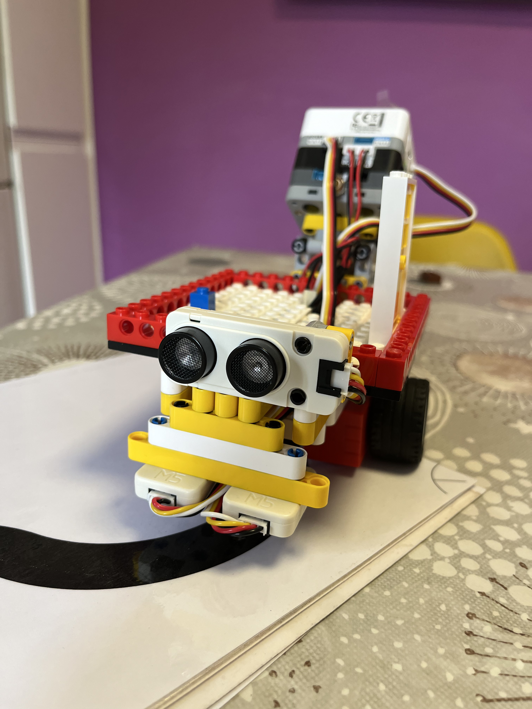
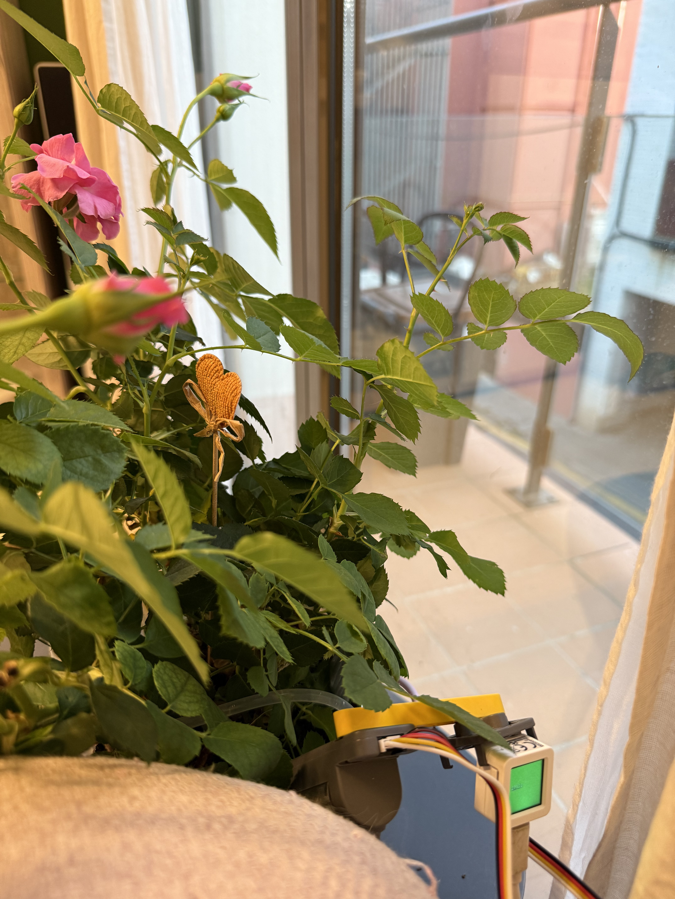

# 🧠 M5Stackademy – STEAM Projects by Neus

**M5Stackademy** is an open STEAM education lab that brings mathematics to life using M5Stack devices, LEGO, and creative electronics.

This is a **living and growing repository**, where each project connects mathematical concepts with real-world applications through code, sensors, and design. It is designed to expand progressively, covering the full secondary math curriculum within an interdisciplinary STEAM framework.

---

## 🎯 Objectives

This repository gathers all STEAM projects developed with M5Stack devices and designed specifically for **secondary education (ESO)**, integrating **programming, mathematics, science, and technology**.

Its goals are to:

- Practice programming with M5Stack (Python and UiFlow 2.0)
- Create interdisciplinary projects for the classroom (math, physics, engineering, etc.)
- Facilitate reuse, modification, and extension of the projects

---

## 🔍 Highlighted Projects

### 🟥 LaserAngle

A goniometer that uses trigonometry to calculate heights from angles and laser-measured distances.  
The laser directly measures the hypotenuse, shifting focus to real-time angle detection and trigonometric reasoning.

  
[▶️ Watch demo on YouTube](https://www.youtube.com/watch?v=X0DargmOZIA)

---

### 🟨 PeanoFactory

A mechanical model of the Peano axioms to explore the foundations of natural numbers.  
It can also integrate robot behavior like line following.



---

### 🟩 Smart Watering System

An automatic irrigation system based on soil moisture and mathematical functions, introducing the concept of dependent variables.



---

## 📁 Repository Structure

```
m5-neus-blocs/
├── bottom2_leds_test/       → RGB LED control for Bottom2 module
├── cardkb_input/            → Using CardKB keyboard for text input
├── custom_blocks_docs/      → Docs for creating custom UiFlow blocks
├── goplus2_servos_test/     → Servo control via GoPlus2
├── patch_macos_m5burner/    → Files for running M5Burner on macOS 15.5
├── steam_projects/          → Main STEAM projects with M5Stack + LEGO
│   ├── nombres_enters/        → Natural numbers and integers (Peano)
│   ├── smart_watering/        → Atom S3-based automatic watering
│   ├── line_follower/         → IR + ultrasound line follower robot
├── README.md                → This file
```

---

## 🛠️ General Requirements

- M5Stack devices (Core2, Atom S3, Fire, StickC, etc.)
- IDE: UiFlow 2.0 or Python (Thonny, VS Code)
- Basic knowledge of Python, electronics, logic
- Common components:
  - IR reflective sensors
  - Ultrasonic sensor
  - GoPlus2 module
  - Bottom2 module (RGB LEDs)
  - CardKB keyboard
  - PbHUB and ExtPort for extra connections

---

## 📚 Educational Vision

Each project is built to help students explore mathematical ideas through **hands-on STEAM learning**, promoting creativity, problem-solving, and real understanding.

---

## 📜 License

This project is licensed under:
**Creative Commons Attribution-NonCommercial-ShareAlike 4.0 International (CC BY-NC-SA 4.0)**

You are free to:

✅ Share — copy and redistribute the material in any medium or format  
✅ Adapt — remix, transform, and build upon the material  
As long as you follow the license terms:

- 🧾 Attribution — Give credit to Neus, link the license, and indicate changes  
- 🚫 NonCommercial — No commercial use  
- 🔁 ShareAlike — Share under the same license  

🔗 [Read the full license](https://creativecommons.org/licenses/by-nc-sa/4.0/)

---

📦 This is part of the [neusmstack GitHub](https://github.com/neusmstack) educational projects.

✍️ Developed by **Neus – @neusmstack**  
📅 June 2025  
📦 Shared to promote **open, creative, and real-world education**
Updated README with images and video
