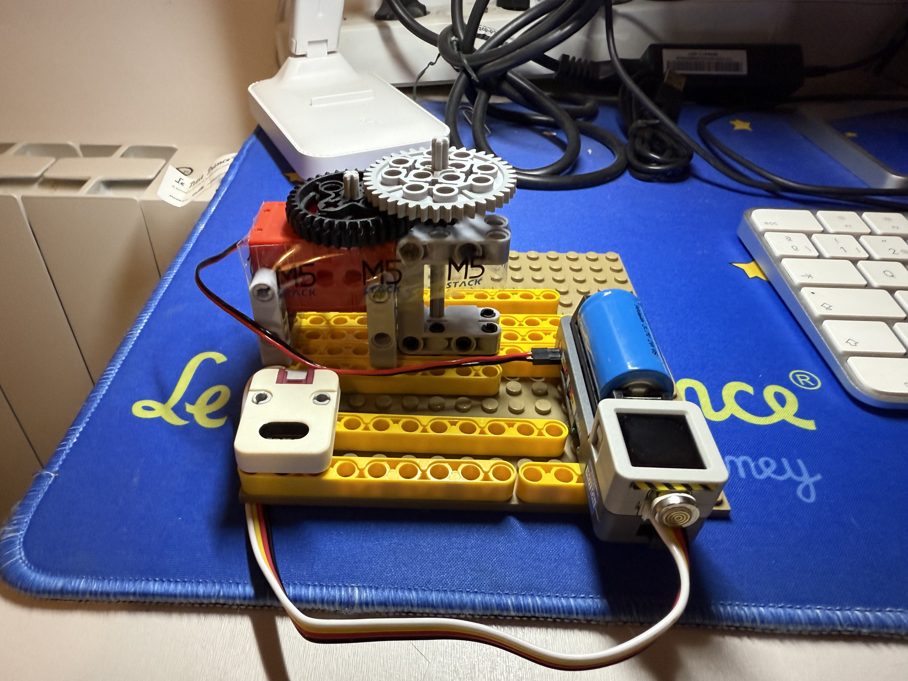
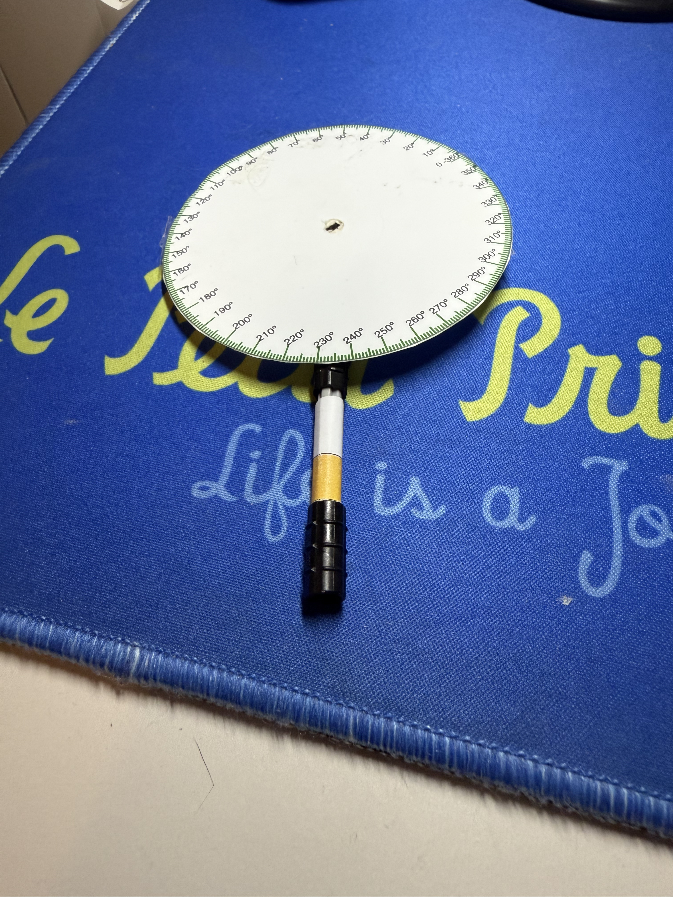
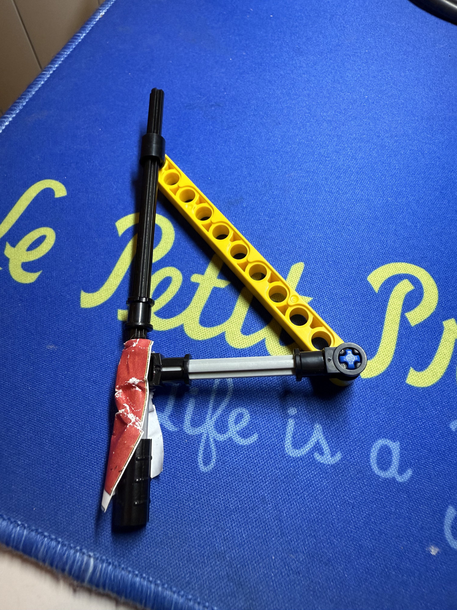
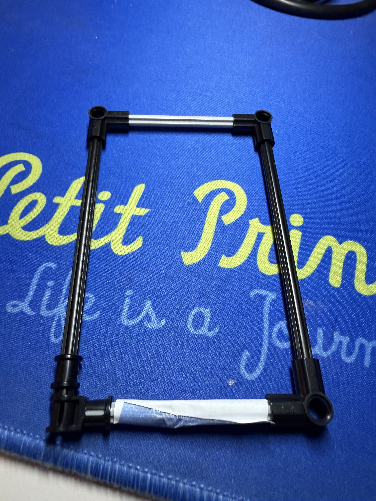
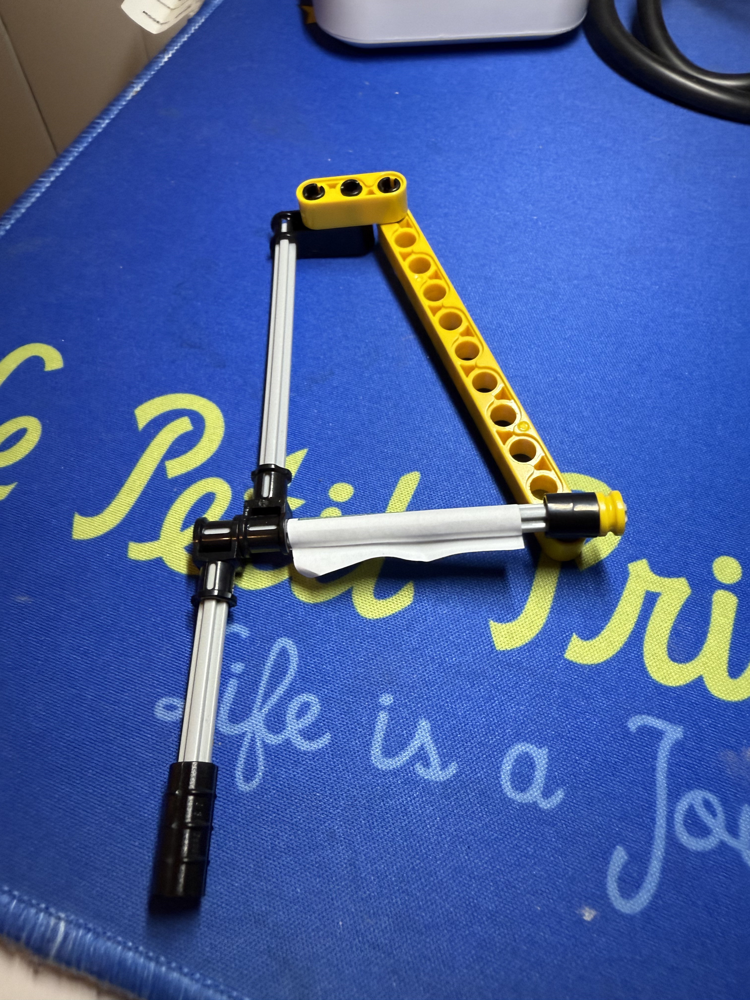

# Generator of Solids of Revolution

This project is part of the **M5Stackademy STEAM Projects** and showcases a fully functional generator of solids of revolution using LEGO structures, a rotating base, and smart color detection.

---

## 🧠 Project Overview

This educational tool allows students to explore the concept of solids of revolution, where 2D shapes (like triangles or circles) generate 3D bodies when rotated. The controller detects the color of each 2D figure and rotates it accordingly to display the solid.

---

## 🔧 Hardware Used

- **M5Stack Atom S3R** (Main controller)
- **M5Stack Atomic Motion Base v1.2**
- **M5Stack Color Sensor Unit (PAHUB-compatible)**
- **Geekservo motor (red)**
- **LEGO-compatible rotating base and figure supports**



---

## ⚙️ Working Principle

1. The student inserts a colored 2D shape on the rotating base.
2. The color sensor reads the RGB values and determines the associated shape.
3. Based on the shape detected:
    - Sphere (Black)
    - Cone (Red)
    - Cylinder (Yellow)
    - Frustum of a Cone (Green)
4. The motor spins the base to generate the solid.

The system is interactive and waits for Button A to be pressed to start the rotation sequence.


---

## 🎨 Figures and Corresponding Solids

Each of the following planar shapes (seen in the images below) generates a 3D solid. The images show the **2D figure** used to create the respective solid.

| Planar Shape | Generated Solid         | Image                        |
|--------------|--------------------------|------------------------------|
| Circle       | Sphere                   |    |
| Right Triangle | Cone                   |        |
| Rectangle    | Cylinder                 |  |
| Trapezoid    | Frustum of a Cone        |   |

---

## 🎥 Demonstration Videos

- **Sphere**: [Watch Video](https://www.youtube.com/shorts/8NFCy88rbRA)
- **Cone**: [Watch Video](https://youtube.com/shorts/4xqhMYRB11k)
- **Cylinder**: [Watch Video](https://youtube.com/shorts/yjn2QT8ZUBk)
- **Frustum of a Cone**: [Watch Video](https://youtu.be/fHufedBD7lA)

---

## 📦 Project Status

✅ Structure built and fully operational  
✅ Motor motion tested and smooth  
✅ Color detection functional (subject to lighting sensitivity)  
🕓 **RFID unit and cards pending** for automatic detection of shapes (future enhancement)

---

## 📁 Repository Structure

```text
📁 generator-of-solids
├── Generator of Solids of Revolution.m5f2
├── README.md
└── images
    ├── generator_setup.jpg
    ├── controller_atom_s3r.jpg
    ├── color_sensor_reading.jpg
    ├── solid_sphere.jpg
    ├── solid_cone.jpg
    ├── solid_cylinder.jpg
    └── solid_frustum.jpg
```

---

## 👩🏻‍🏫 Author

**Neus M.**  
Educator & STEAM developer  
GitHub: [neusmstack](https://github.com/neusmstack)

---

> *This project is designed for classroom use and demonstration purposes in secondary education.*